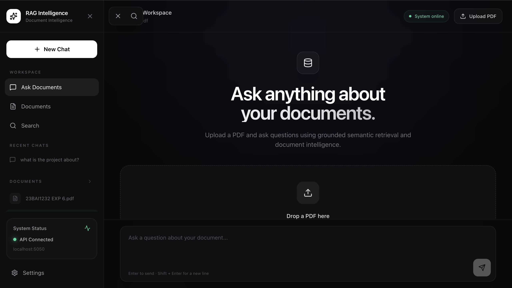
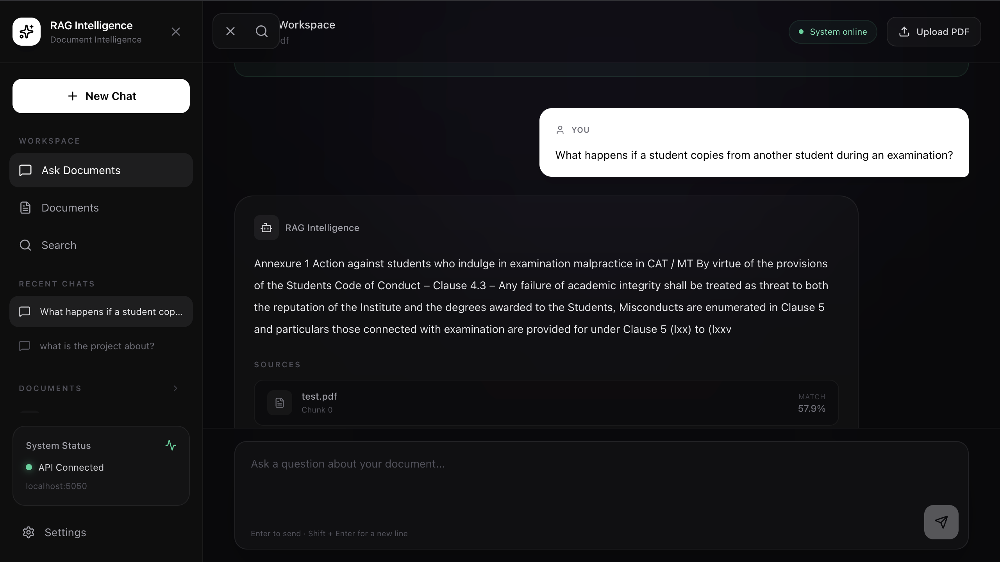
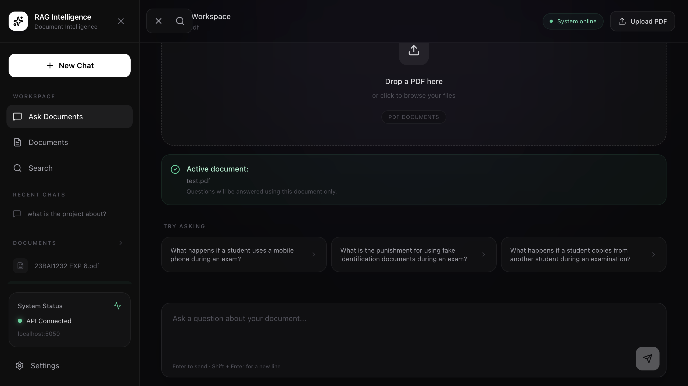

# RAG Intelligence: Document Intelligence Platform

An end-to-end **Retrieval-Augmented Generation (RAG)** platform that transforms PDF documents into an intelligent, searchable knowledge base using **semantic retrieval, vector embeddings, and document-grounded question answering**.

RAG Intelligence allows users to upload PDF documents, automatically process and index their content, search across documents using semantic similarity, and interact with their knowledge base through a conversational AI workspace.


---

## Document Intelligence Workspace

The main workspace provides a centralized interface for interacting with uploaded documents. Users can upload PDFs, select an active document, and ask natural-language questions about the document content.



The workspace is designed around a document-first interaction model, where retrieved information is used to generate grounded responses instead of relying only on general model knowledge.

---

## Document Management

The document management interface provides a centralized view of indexed PDF files.


Each uploaded document is processed and indexed into the retrieval pipeline. Users can view available documents, identify the active document, switch between documents, and manage the indexed knowledge base.

---

## Semantic Search

RAG Intelligence includes a dedicated semantic search interface for retrieving information across indexed documents.


Instead of depending only on exact keyword matching, the system represents document content and user queries as vectors and performs similarity-based retrieval.

```text
User Query
     |
     v
Query Embedding
     |
     v
Vector Similarity Search
     |
     v
Relevant Document Chunks
     |
     v
Retrieved Information
````

This allows conceptually related information to be retrieved even when the wording of the query differs from the original document.

---

## Document-Grounded Question Answering

The conversational interface allows users to ask questions directly about an uploaded document.



When a question is submitted, the retrieval pipeline identifies relevant document chunks and provides them as context for the generated response.

The interface also exposes the retrieved sources and their similarity scores, making the retrieval process more transparent.

---

## PDF Upload and Processing

Users can upload PDF documents directly through the workspace.



After upload, the document enters the processing pipeline where its content is extracted, divided into manageable chunks, converted into vector embeddings, and stored for semantic retrieval.

---

## RAG Architecture

```text
                    PDF DOCUMENT
                         |
                         v
                  Document Upload
                         |
                         v
                   Text Extraction
                         |
                         v
                    Chunking
                         |
                         v
                 Embedding Model
                         |
                         v
              PostgreSQL + pgvector
                         |
                         |
User Query ------------>|
                         |
                         v
                Semantic Retrieval
                         |
                         v
               Relevant Top-K Chunks
                         |
                         v
                 RAG Context
                         |
                         v
                Response Generation
                         |
                         v
             Grounded Answer + Sources
```

---

## Core Features

| Feature                  | Description                                                  |
| ------------------------ | ------------------------------------------------------------ |
| PDF Processing           | Upload and process PDF documents                             |
| Text Extraction          | Extract textual content from uploaded documents              |
| Chunking                 | Divide documents into retrieval-friendly chunks              |
| Vector Embeddings        | Convert document chunks into semantic vector representations |
| Vector Database          | Store embeddings using PostgreSQL and pgvector               |
| Semantic Search          | Retrieve information based on semantic similarity            |
| RAG                      | Generate responses using retrieved document context          |
| Source Retrieval         | Display relevant document chunks and similarity scores       |
| Document Management      | View, select and manage indexed documents                    |
| Active Documents         | Direct questions toward the selected document                |
| Conversational Interface | Ask natural-language questions about documents               |

---

## Technology Stack

### Frontend

**React**
Component-based interface for the document intelligence workspace.

**Vite**
Fast development and frontend build tooling.

**Tailwind CSS**
Utility-first styling used to create the modern dark interface.

### Backend

**Node.js**
Runtime environment for the application backend.

**Express.js**
Backend framework responsible for API and application services.

### AI and Retrieval

**Retrieval-Augmented Generation (RAG)**
Combines retrieval with generative AI to produce document-grounded responses.

**Vector Embeddings**
Represent document chunks and queries in a semantic vector space.

**Semantic Search**
Retrieves relevant information based on meaning rather than only exact keywords.

### Database and Infrastructure

**PostgreSQL**
Primary database for storing document and application data.

**pgvector**
Provides vector storage and similarity search capabilities inside PostgreSQL.

**Redis**
Used as supporting infrastructure for application-level data and processing.

### Document Processing

**PDF Text Extraction**
Extracts content from uploaded PDF documents.

**Document Chunking**
Breaks extracted content into smaller units optimized for retrieval.

---

## End-to-End Workflow

```text
1. User uploads a PDF
          |
          v
2. Document content is extracted
          |
          v
3. Content is divided into chunks
          |
          v
4. Embeddings are generated
          |
          v
5. Embeddings are stored in pgvector
          |
          v
6. User asks a question
          |
          v
7. Query embedding is generated
          |
          v
8. Relevant chunks are retrieved
          |
          v
9. Retrieved context is passed to RAG
          |
          v
10. Grounded response is generated
          |
          v
11. Sources are displayed to the user
```

---

## Project Structure

```text
RAGPDF/
│
├── backend/
│   └── ...
│
├── frontend/
│   └── ...
│
├── docs/
│   └── images/
│       ├── dashboard.png
│       ├── documents.png
│       ├── search-feature.png
│       ├── chat1.png
│       └── uploaded.png
│
└── README.md
```

---

## Running Locally

### Backend

```bash
cd backend
npm install
npm run dev
```

Backend:

```text
http://localhost:5050
```

### Frontend

Open another terminal:

```bash
cd frontend
npm install
npm run dev
```

Frontend:

```text
http://localhost:5173
```

Make sure PostgreSQL with pgvector, Redis, and the required environment variables are configured before starting the application.

---

## Why RAG Intelligence?

Traditional document systems often rely on keyword matching or manual navigation through large files.

RAG Intelligence combines **document processing, vector embeddings, semantic retrieval, and generative AI** to create a more intelligent document interaction workflow.

The result is a platform where users can move from:

**PDF → Search → Retrieval → Context → Grounded Answer**

without manually searching through every page of a document.

---

## Future Improvements

* Hybrid keyword and vector retrieval
* Retrieval reranking
* Multi-document conversations
* Streaming responses
* OCR support for scanned documents
* Page-level source references
* User authentication
* Advanced metadata filtering
* Additional document formats
* Retrieval evaluation and benchmarking

---

## Author

**Rajat Murhe**

B.Tech Computer Science Engineering

```
